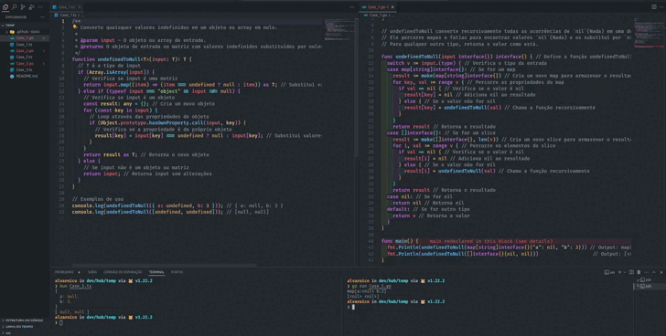
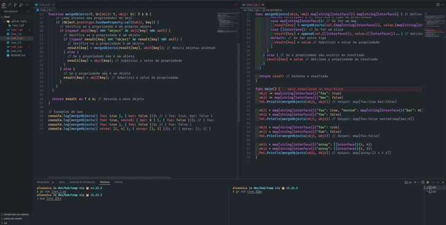
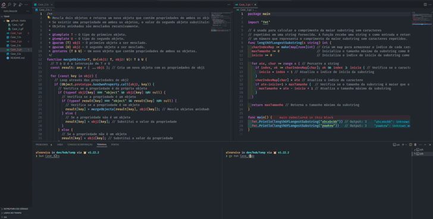

# Teste NuVidio

Você deve criar um repositório contendo a solução dos problemas e enviar o link para XPTO

**Nas entrevista após o teste, você vai precisar dar uma breve explicação sobre como você solucionou os problemas**

Para começarmos, escolhemos alguns problemas clássicos do Javascript para você escrever em **Typescript**

Aqui você ganha pontos se conseguir usar _features_ chaves do Typescript, como **tipagens assertivas**, **_generics_, _type guards_** e etc.

1. Escreva uma função _undefinedToNull_ que recebe um objeto ou array de objetos e cria uma cópia do objeto ou array substituindo todos os _undefined_ por _null_.

undefinedToNull({"a": undefined, "b": 3}) // {"a": null, "b": 3} undefinedToNull([undefined, undefined]) // [null, null]

</img>

2. Escreva uma função que faça a mesclagem de dois objetos, e em caso de propriedades conflitantes, avaliar a possibilidade de mesclagem (arrays ou objetos aninhados). Se não for possível, o segundo objeto deve substituir o primeiro.

   _exemplos_

   Input: obj1 = { foo: true }, obj2 = { bar: false } Output: { foo: true, bar: false }

   Explanation: Mesclagem simples, sem conflitos

   Input:

obj1 = { foo: true, nested: { bar: 0 } }

obj2 = { foo: false }

Output: { foo: false, nested: { bar: 0 } }

Explanation: Mesclagem simples, sem conflitos, com cópia de objeto aninhado

Input: obj1 = { foo: true }, obj2 = { foo: false }

Output: { foo: false }

Explanation: Houve conflito, não foi possível mesclar as propriedades conflitantes, o segundo sobrescrever o primeiro

Input: obj1 = { array: [2, 4] }, obj2 = { array: [1, 3] } Output: { foo: false, nested: { bar: 0 } }

Explanation: Houve conflito, foi possível mesclar **as** propriedades conflitantes

</img>

Por fim, um problema relacionado a **algoritmos e estrutura de dados**

Você pode resolver em Typescript ou em GO (em GO você ganha mais pontos), **quanto mais soluções você apresentar melhor.**

1\. Dado uma string qualquer, procure o tamanho da maior substring sem caracteres repetidos

**Assinatura da função precisa ser**

**function** lengthOfLongestSubstring(s: string): number _exemplos_

Input: s = "abcabcbb"

Output: 3

Explanation: A resposta é "abc", de tamanho 3.

Input: s = "pwwkew"

Output: 3

Explanation: A resposta é "wke", de tamanho 3.
</img>